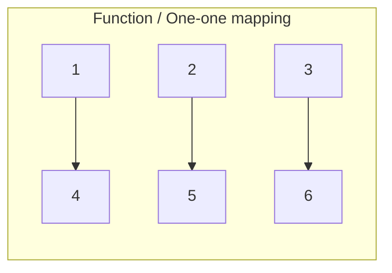
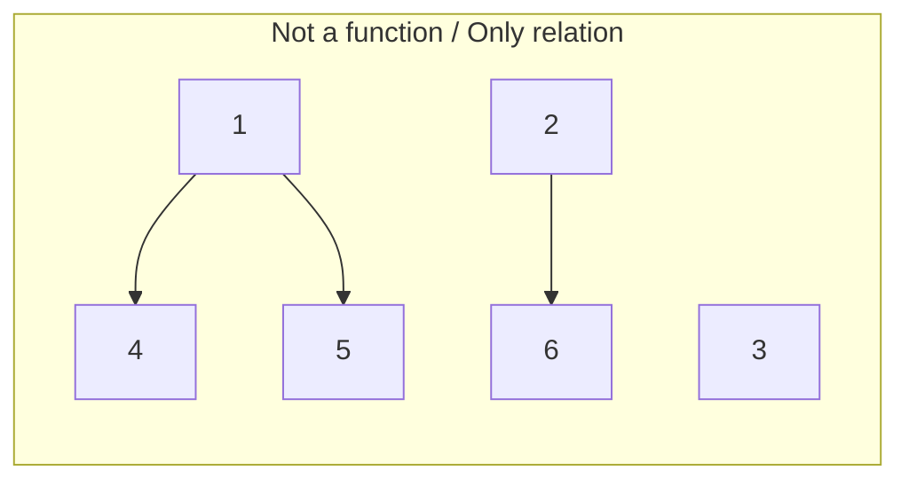
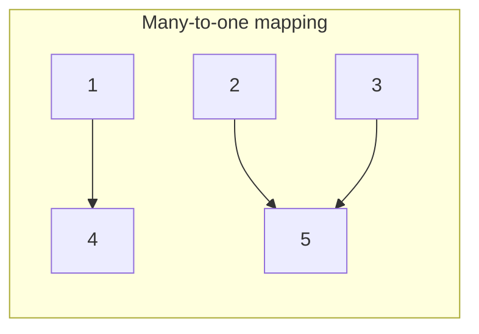

<!-- Page 061 -->
**Example:**
$e_1 = (1, 0)$
$e_2 = (0, 1)$
$V = 2e_1 + 3e_2 = 2(1, 0) + 3(0, 1) = (2, 3)$

$c_1v_1 + c_2v_2 + \dots + c_nv_n$ is called a linear combination, where $c_1, c_2, \dots, c_n \in \mathbb{R}$.

**Span of $V$:**
With two vectors we can find any vector, then those vectors ($e_1, e_2$) are called the span of $\mathbb{R}^2$.

| $\mathbb{R}^2$ independent | $\mathbb{R}^2$ dependent |
| :--- | :--- |
| $e_1 = (1, 0)$<br>$e_2 = (0, 1)$<br>$(100, 200) = 100(1, 0) + 200(0, 1) = 100e_1 + 200e_2$ | $(3, 2) \in \mathbb{R}^2$ <br> $(3, 2) = 1(1, 0) + 1(2, 0) + 1(0, 2)$ |

- দুইটা vector independent হলে span যেকোনো vector তৈরি করতে পারবে (2x2) $\rightarrow$ (3x3) হলে 3টা independent লাগবে (minimum 3টি).
- dependent হলে আরও vector লাগবে।

$\mathbb{R}^3$ এর সকল vector generate করা যাবে:
$e_1 = (1, 0, 0)$
$e_2 = (0, 1, 0)$
$e_3 = (0, 0, 1)$

<!-- Page 062 -->
**Dependent example:**
$(4, 5) = (0, 1) + (0, 1) + (0, 2) + (4, 1)$
where the vectors are $v_1, v_2, v_3, v_4$.

**Linear dependence and independence of vectors:**

**Method 1: Echelon matrix**
*Steps:*
1. First form the matrix with the row vectors.
2. Reduce it to its echelon form.

**Example:**
$v_1 = (1, 2, 3)$, $v_2 = (4, 5, 6)$, $v_3 = (1, 1, 1)$.

$$
A = \begin{pmatrix} 1 & 2 & 3 \\ 4 & 5 & 6 \\ 1 & 1 & 1 \end{pmatrix}
$$

Applying row operations:
$R_2 \rightarrow 4R_1 - R_2$
$R_3 \rightarrow R_1 - R_3$

$$
\sim \begin{pmatrix} 1 & 2 & 3 \\ 0 & 3 & 6 \\ 0 & 1 & 2 \end{pmatrix}
$$

Applying row operation:
$R_3 \rightarrow 3R_3 - R_2$

$$
\sim \begin{pmatrix} 1 & 2 & 3 \\ 0 & 3 & 6 \\ 0 & 0 & 0 \end{pmatrix}
$$

Here, $\text{Rank} = 2$.
It has two non-zero rows. That's why it is of rank 2. So the vectors are linearly dependent.
Since the number of vectors is 3 and rank is 2, we cannot span $\mathbb{R}^3$ by $v_1, v_2, v_3$. We need more vectors.

> [!NOTE]
> Both matrices are same / not same but carries the same info.

<!-- Page 063 -->
**# $\mathbb{R}^3$ from 4 vectors:**
$v_1 = (2, 3, 4)$
$v_2 = (1, 2, 1)$
$v_3 = (1, 1, -1)$
$v_4 = (1, 1, 2)$

*Without checking, find if they are independent:*
- $\mathbb{R}^3$ থেকে ৩টার বেশি vector থাকলে একটা dependent হবেই cause rank 3 এর বেশি হবে না।
- ৩ এর বেশি হলেই বলে দিব dependent for $\mathbb{R}^3$.
- ৩টা vector থাকলে determinant 0 হলে dependent.

**Method 2: Linear combination**
$v_1, v_2, \dots, v_n \in V$
$c_1v_1 + c_2v_2 + \dots + c_nv_n = 0_{\text{vector}}$
- $c_1, c_2, \dots, c_n = 0$ (সবগুলো $0$ হলে) $\rightarrow$ independent.
- $0$ না হলে (at least one non-zero) $\rightarrow$ dependent.

**Example:**
$c_1(1, 2) + c_2(3, 2) = (0, 0)$

$$
\left. \begin{aligned} c_1 + 3c_2 &= 0 \\ 2c_1 + 2c_2 &= 0 \end{aligned} \right\rbrace \Rightarrow \begin{aligned} c_1 &= 0 \\ c_2 &= 0 \end{aligned}
$$

Since both coefficients are 0, the vectors are linearly independent.

<u>**span set**</u>

<!-- Page 064 -->
<b>Class 28 | sir</b>
<div align="right"><b>11-04-26</b></div>

**Linear dependence and independent vectors (def):**
- Linear combinations
- Superposition / homogeneity condition $\rightarrow$ linear mapping

**# What is meant by span? (vector span) (linearly span of $\mathbb{R}^3$):**
- যতগুলো vector দিয়ে ঐ vector space জেনারেট করা যাবে, ঐ vector গুলোকে বলা হবে ঐ space এর span.
- ঐগুলোর সেট হলো set of span.

**Vector spaces:**
- Set of all straight lines, set of all polynomials, set of all real numbers, etc.

**# Why to study vector space?**
- Vector field থেকে vector space এ transformation এর জন্য।

**# Basis and dimension:**
- (৩টি independent) ($\mathbb{R}^3$) $\rightarrow$ যতগুলো independent vector দিয়ে generate করা যায়, তাই dimension.

**# Let $\mathbb{R}^3$ জেনারেট করছি $\{v_1, v_2, v_3, v_4\}$ spanning set দিয়ে:**
- $\{v_1 = (1,0,0), v_2 = (0,1,0), v_3 = (0,0,1)\}$ $\rightarrow$ usual / standard basis (৩টি).
- Minimum spanning set & independent হলেই basis.
- ৩টার কম হবে না।

**# Basis হতে হলে:**
1. Linearly independent
2. Minimum spanning set

<!-- Page 065 -->
**# Basis রূপান্তর:**
- $\mathbb{R}^2$ এর usual basis $\rightarrow \{(1, 0), (0, 1)\}$.
- Dependent vector basis হতে পারে না এবং dimension concept vector number এর basis এ valid না।

**Sum & Direct Sum:**
Let $W, U$ be vector spaces.
- **Sum:**
  $W + U = \{ v = u + w \mid u \in U, w \in W \}$
  $\text{dim}(W + U) = \text{dim}(W) + \text{dim}(U) - \text{dim}(W \cap U)$
- **Direct Sum:**
  $U \oplus W \rightarrow \text{dim}(U \cap W) = 0$ (একে direct sum বলে)

**# Linear mapping (def):**
- Mapping, function, operator
- Let $A$ and $B$ be two non-empty sets.
- $A$ এর প্রতিটি element এর সাথে $B$ এর element mapping/connection থাকলে তাকে function/mapping/operator বলে।

**Function হতে শর্ত:**
1. $A$ এর প্রতিটি element এর connection থাকতে হবে।
2. $A$ এর একটি element এর সাথে একের অধিক $B$ element এর connection হতে পারবে না।







- $one-one + onto = bijective$.

<!-- Page 066 -->
**Linear mapping:**
Let $U$ and $V$ be two vector spaces. A mapping $T: U \rightarrow V$ is called a linear mapping if:
1. $T(u+v) = T(u) + T(v)$ (Superposition theorem)
2. $T(ku) = kT(u)$ (Homogeneity theorem)

```
        Domain (U)                        Codomain (V)
   +-------------------+             +---------------------+
   |    u, v           | ----------> |   T(u)=v1, T(v)=v2  |
   |                   |    T        |                     |
   |    u + v          | ----------> |  T(u+v) = v1 + v2   |
   |                   |             |                     |
   |    ku             | ----------> |  T(ku) = k T(u)     |
   +-------------------+             +---------------------+
```

- Superposition: $T(u+v) = T(u) + T(v)$
- Homogeneity: $T(ku) = kT(u)$

<!-- Page 067 -->
**Example:**
- $\frac{d}{dx}(3x^2) = 3 \frac{d}{dx}(x^2) \rightarrow$ Homogeneity (since it is a linear operator)
- $\frac{d}{dx}(x^2 + x^3) = \frac{d}{dx}(x^2) + \frac{d}{dx}(x^3) \rightarrow$ Superposition

$$
\text{Superposition} + \text{Homogeneity} = \text{Linearity condition}
$$

<b>Class 29 | sir</b>
<div align="right"><b>13-04-26</b></div>

**# A mapping $f: \mathbb{R}^2 \rightarrow \mathbb{R}^2$ is defined as $f(x, y) = (2x, 2y)$. Show that it is a linear mapping.**

> [!NOTE]
> Mapping must be defined on vector spaces. Same vector space to same vector space mapping is called an operator.

*Proof:*
Let,
$u = (a, b) \in \mathbb{R}^2$
$v = (a', b') \in \mathbb{R}^2$

Now,
$u + v = (a + a', b + b')$

**First condition (Superposition):**
$f(u+v) = f(a+a', b+b') = (2(a+a'), 2(b+b'))$

Again,
$f(u) = (2a, 2b)$
$f(v) = (2a', 2b')$

<!-- Page 068 -->
$f(u) + f(v) = (2a, 2b) + (2a', 2b')$
$= (2(a+a'), 2(b+b'))$

Thus, $f(u+v) = f(u) + f(v)$ (First condition satisfied).

**Second condition (Homogeneity):**
$ku = (ka, kb)$
$f(ku) = f(ka, kb) = (2ka, 2kb)$
$kf(u) = k(2a, 2b) = (2ka, 2kb)$

Thus, $f(ku) = kf(u)$ (Second condition satisfied).
Therefore, the mapping is a linear mapping.

---

**Projection mapping:**
Projection can be onto the $xy$-plane, $yz$-plane, or $xz$-plane.

**# The projection mapping $f: \mathbb{R}^3 \rightarrow \mathbb{R}^3$ is defined as $f(x, y, z) = (x, y, 0)$ (projection onto $xy$-plane). Show that it is a linear mapping.**

Let,
$u = (a, b, c) \in \mathbb{R}^3$
$v = (a', b', c') \in \mathbb{R}^3$

Now,
$u + v = (a+a', b+b', c+c')$

<!-- Page 069 -->
$f(u+v) = (a+a', b+b', 0)$

Again,
$f(u) = (a, b, 0)$
$f(v) = (a', b', 0)$
$f(u) + f(v) = (a+a', b+b', 0)$

Thus, $f(u+v) = f(u) + f(v)$ (First condition satisfied).

**Homogeneity:**
$ku = (ka, kb, kc)$
$f(ku) = (ka, kb, 0)$
$kf(u) = k(a, b, 0) = (ka, kb, 0)$

Thus, $f(ku) = kf(u)$ (Second condition satisfied).
Therefore, the mapping is a linear mapping.

<!-- Page 070 -->
**# A mapping $f: \mathbb{R}^2 \rightarrow \mathbb{R}^2$ defined as $f(x, y) = (xy, x)$. Show that it is not a linear mapping.**

Let,
$u = (a, b) \in \mathbb{R}^2$
$v = (a', b') \in \mathbb{R}^2$
$ku = (ka, kb)$

Checking homogeneity:
$f(u) = (ab, a)$
$f(ku) = f(ka, kb) = ((ka)(kb), ka) = (k^2ab, ka)$
$kf(u) = k(ab, a) = (kab, ka)$

Since $f(ku) \neq kf(u)$ for general $k$, homogeneity fails.
Therefore, it is not a linear mapping.

---

<b>Class 30 | sir</b>
<div align="right"><b>18-04-26</b></div>

**# Differentiate between linear operator and linear mapping:**
- **Linear operator:** Mapping from a vector space to itself (same vector space, e.g., $T: V \rightarrow V$) defined on $\mathbb{R}$ or $\mathbb{C}$.
- **Linear mapping:** Mapping from one vector space to another vector space (e.g., $T: V \rightarrow W$).

Both satisfy the linearity properties:
1. $T(u+v) = T(u) + T(v)$
2. $T(ku) = kT(u)$

> [!NOTE]
> সকল অপারেটর-ই ম্যাপিং কিন্তু সকল ম্যাপিং অপারেটর না (All operators are mappings, but not all mappings are operators).